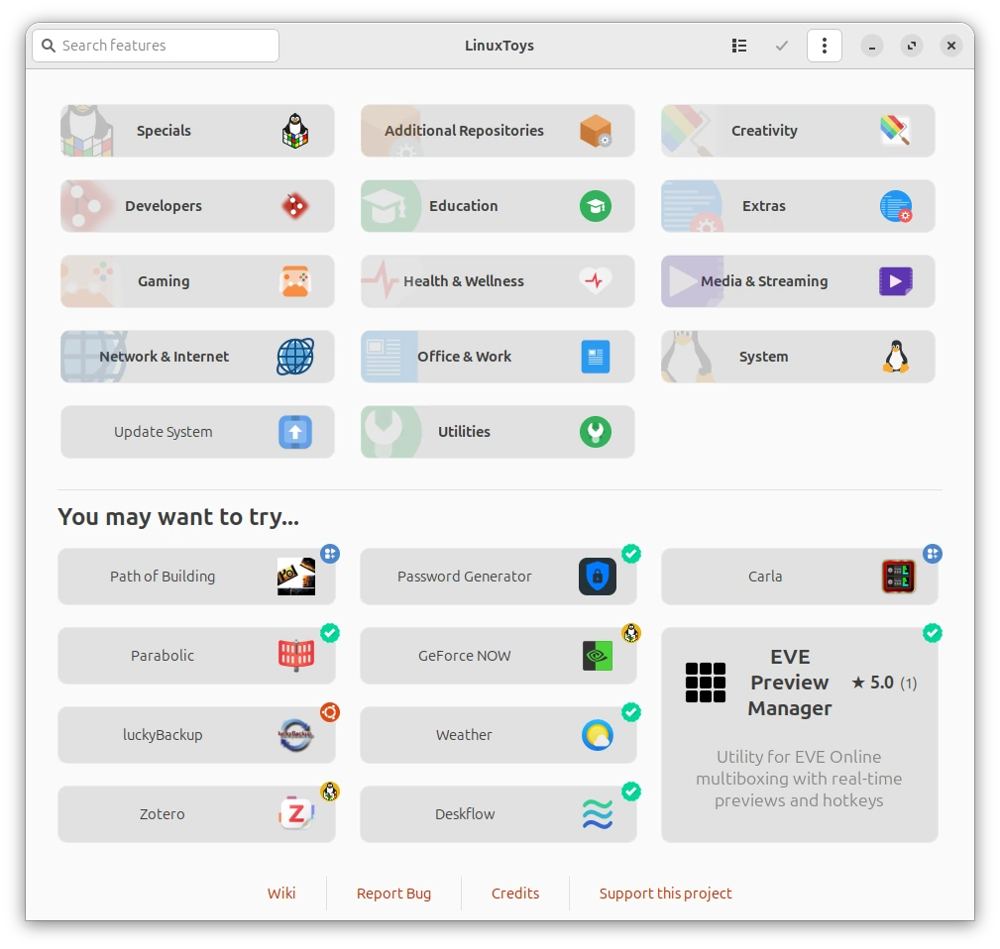

# LinuxToys

[LinuxToys](https://linux.toys) is a software distribution platform for Linux systems. It aims to make powerful Linux functionality simple and accessible to all users through an intuitive interface, and enable developers to ship their apps consistently and reliably by giving them control over the installation process of their apps, all in one solution for dozens of Linux distributions.

<picture>
  <source media="(prefers-color-scheme: dark)" srcset="src/screenshot-dark.webp">
  
</picture>

## Compatibility

LinuxToys is compatible with the following Linux distributions, provided they are *running their **latest** stable versions*:

*   **Debian** and derivatives (PikaOS, LMDE, Tuxedo, etc.)
*   **Ubuntu** and derivatives (Ubuntu flavours, Mint, Zorin, etc.)
*   **Fedora** and derivatives (Nobara, Ultramarine and spins)
*   **Red Hat Enterprise Linux** and similars (CentOS Stream, AlmaLinux, etc.)
*   **Arch Linux** and derivatives (EndeavourOS, CachyOS, etc.)
*   **Manjaro** and **Big Linux**
*   **OpenSUSE** (Leap, Slowroll and Tumbleweed)
*   Fedora-based **Atomic Distributions** (Atomic Fedora, Universal Blue images like Bazzite, Bluefin, Aurora)
*   **Solus**
*   **Deepin**
*   **SteamOS**

Only x86 computers are supported, as other architectures lack support from most packages that are components of LinuxToys, even though the app itself may run on ARM devices. Support for non-systemd init systems is limited, and some features of the app cannot be offered for them.

## Installation

### Automatic Installation

The simplest way to install LinuxToys is by using the automated installation script. Open your terminal and run:

```bash
curl -fsSL https://linux.toys/install.sh | bash
```

This will automatically pick the correct package option for your distribution and install it.

### Manual Installation

If you prefer to review the script before running it, you can download and execute it manually:

```bash
curl -fsSLJO https://linux.toys/install.sh
chmod +x install.sh
./install.sh
```

You may also pick the package that suits your system best yourself.

### Official Repositories

LinuxToys is available in several official and community repositories for easier package management.

#### Ubuntu (PPA)

You can install LinuxToys from our official PPA on [Launchpad](https://launchpad.net/~psygreg/+archive/ubuntu/linuxtoys):

```bash
sudo add-apt-repository ppa:psygreg/linuxtoys
sudo apt update
sudo apt install linuxtoys
```

#### Fedora / RHEL / OpenSUSE (COPR)

Packages are available via [Fedora COPR](https://copr.fedorainfracloud.org/coprs/psygreg/linuxtoys/) for the latest releases of AlmaLinux, Fedora and RHEL.

**For Standard Systems:**

```bash
sudo dnf copr enable psygreg/linuxtoys
sudo dnf install linuxtoys
```

**For Atomic Systems (Fedora Atomic, Universal Blue):**

```bash
curl -fsSL https://copr.fedorainfracloud.org/coprs/psygreg/linuxtoys/repo/fedora-$(rpm -E %fedora)/psygreg-linuxtoys-fedora-$(rpm -E %fedora).repo | sudo tee /etc/yum.repos.d/psygreg-linuxtoys-fedora-$(rpm -E %fedora).repo
sudo rpm-ostree install linuxtoys
```

#### Arch Linux (AUR)

Arch Linux users can install the `linuxtoys-bin` package from the [AUR](https://aur.archlinux.org/packages/linuxtoys-bin):

```bash
git clone https://aur.archlinux.org/linuxtoys-bin.git
cd linuxtoys-bin
makepkg -si
```

## SteamOS and usage without installation

You may use the AppImage available at the latest release to use LinuxToys without requiring installation. For SteamOS, the automatic installer will integrate this AppImage using *Gear Lever*.

## Development [GIT](https://github.com/psygreg/linuxtoys/)

For running the application from source, please follow these steps.

### Prerequisites

Ensure your system has the necessary dependencies installed. Those will include build dependencies and python virtual environment setup.

**Debian/Ubuntu:**
```bash
sudo apt install -y bash git curl wget zenity appstream libappstream5 python3 python3-gi python3-requests libgtk-3-0 gir1.2-gtk-3.0 gir1.2-vte-2.91 gir1.2-appstream-1.0 cargo python3-dev python3-maturin python3-venv
```

**Fedora/RHEL:**
```bash
sudo dnf install -y bash git curl wget zenity appstream appstream-data python3 python3-gobject python3-requests gtk3 vte291 cargo python3-devel maturin
```

**Arch Linux:**
```bash
sudo pacman -S --noconfirm bash git curl wget zenity appstream archlinux-appstream-data python python-gobject python-requests gtk3 vte3 cargo maturin
```

**OpenSUSE:**
```bash
sudo zypper in -y bash git curl wget zenity libappstream5 python3 python3-gobject python3-requests gtk3 libvte-2_91-0 typelib-1_0-Vte-2.91 typelib-1_0-AppStream-1_0 cargo python3-devel python3-maturin
```

**Solus:**
```bash
sudo eopkg it -y git curl wget zenity appstream python3 python-gobject python-requests libvte cargo python-devel
```
> For Solus, you will have to install `maturin` using `pip` on the virtual environment you will set up in the next steps.

### Cloning and Running

**Clone the repository:**
```bash
git clone --depth=1 https://github.com/psygreg/linuxtoys.git
cd linuxtoys
```

**Build rust library for development**
Start by setting up a python virtual environment for maturin, from the repository root:
```bash
python3 -m venv --system-site-packages .venv
source .venv/bin/activate
```
Then compile the library:
```bash
maturin develop --release
```
> The compiled rust library for development and testing, virtual environment files and building artifacts are automatically ignored by the repository if you follow this procedure correctly.

**Run the application:**
```bash
p3/linuxtoys.py
```

For developers who wish to contribute, check our documentation, please refer to the [Contribution Guidelines](CONTRIBUTING.md).

To distribute your app through LinuxToys, check out the [Developer Portal](https://dev.linux.toys).
