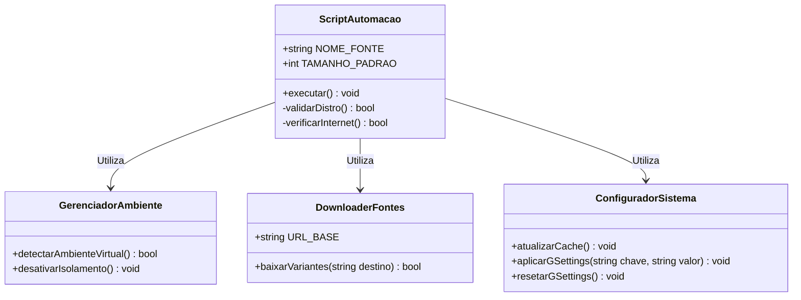

# Fase III: Modelagem UML Textual (O "Como")

Esta seção apresenta os diagramas arquiteturais baseados estritamente nas regras e fluxos de execução do MVP de acessibilidade tipográfica.

## 3. Diagrama de Classes (Responsabilidades Lógicas do Script)

O diagrama abaixo detalha a representação lógica das responsabilidades internas mapeadas no escopo da automação. Embora implementado em Shell Script estruturado, a abstração em classes demonstra a separação de conceitos (Coesão e Baixo Acoplamento) adotada no design do software.

